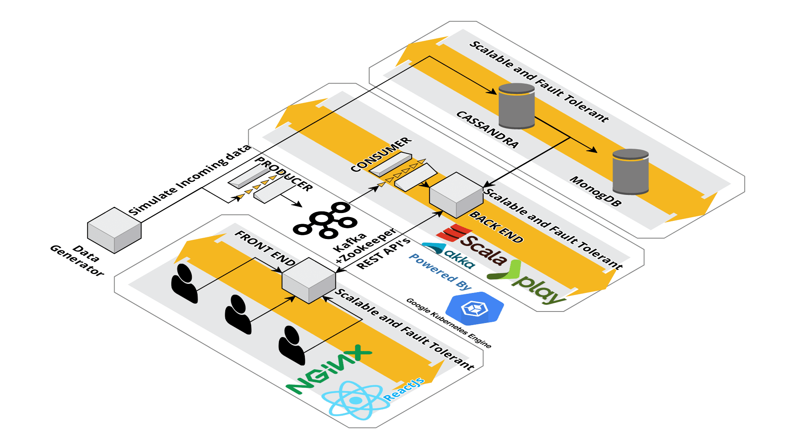
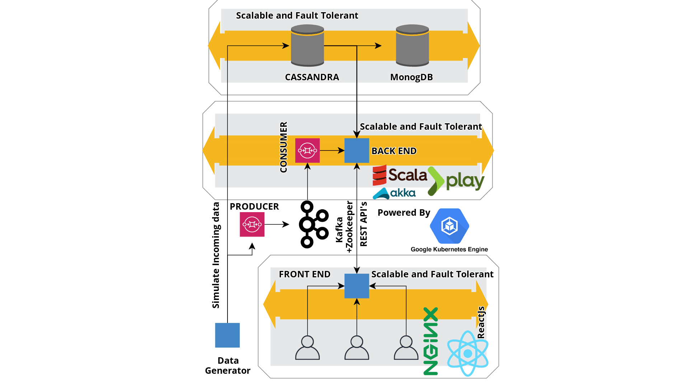
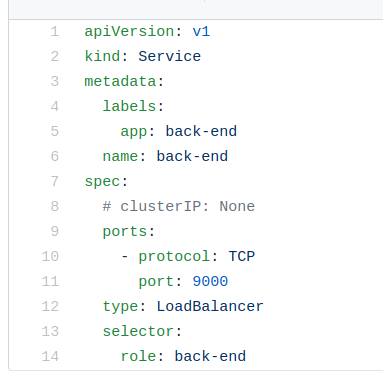
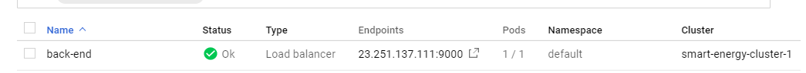

# 2019_group_30_s4151968_s4056167_s3922782

## Project Architecture  

### How to run  

### Requirements  

- The kubectl context should be referencing to either Minikuber or any Cloud platform.  

To deploy the application execute the scripts in order.

Note: Minikube does not support Loadbalancer and if you are deploying the application in Minikube context, change the type of the port in back-end-service.yaml to **NodePort** and for a cloud deployment change the port type to **LoadBalancer**.  
Sample back-end-service.yaml  

- **deploy.sh** for Linux based system or **deploy.bat** for windows based system.  

- Obtain the external ip of the backend service.  
   Minikube
    - run the command **minikube service back-end --url** and copy the **Ip address with the port number** without the http/https.  
   
   Cloud Platform  
    - The External address of the back-end service will be the **Ip address and the port number**  
    
      
    
- Update the API_URL IP adress in the [**front-end-statefulset.yaml**](https://github.com/rug-wacc/2019_group_30_s4151968_s4056167_s3922782/blob/development/docs/kubernetes/working/front-end/front-end-statefulset.yaml) with the back-end IP address obtained.
- execute the **deploy_front_end.sh** for Linux based system or **deploy_front_end.bat** for windows based system.  

- To access the Web application  
  Minikube  
   - execute the command **minikube service front-end** and the application will open in the web browser.  
  Cloud Platform  
   - Access the endport assigned to the front-end to access the Web Application.  
   
     

### Teardown  
 - run the **teardown.sh** for Linux based system or **teardown.bat** for windows based system.  
 
 For any assistance regarding the execution of this application kindly open an issue.  
 
 ### Project Report 
 The project report can be found in the root director of this project under the name [**Wacc_smart_energy_system_report_Group_30.pdf**](https://github.com/rug-wacc/2019_group_30_s4151968_s4056167_s3922782/blob/development/Wacc_smart_energy_system_report_Group_30.pdf)    
